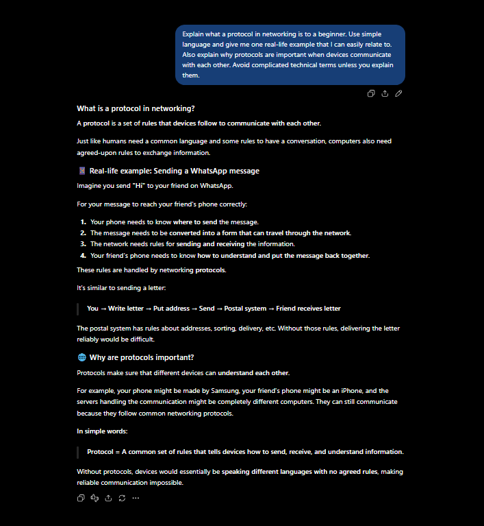
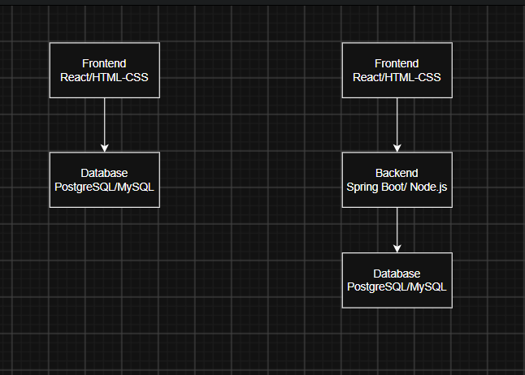
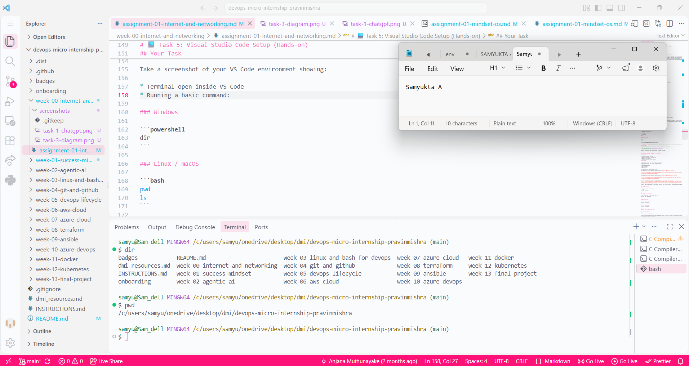

# Week 00 - Internet and Networking

Part of the DevOps Micro Internship (DMI) Cohort 3 with Agentic AI

---

# 🧑‍💻 Task 1: Using ChatGPT as Your Learning Assistant

## Scenario

You're new to DevOps and will frequently encounter technical questions. ChatGPT can be your learning companion.

## Your Task

Write a clear ChatGPT prompt to help you understand:

> "What is a protocol in networking? Explain with a simple real-life example."

Take a screenshot of your interaction showing:

- Your detailed prompt (with clear expectations)
- ChatGPT's simplified response with an example

## Screenshot



---

## What I Learned (2–3 lines)

I learned that a networking protocol is basically a set of rules that devices follow to communicate with each other. The real-life example helped me understand that without common rules, devices would not know how to properly exchange information.

---

# 🌐 Task 2: Internet and Networking

## Scenario

Your friend is launching an online bookstore named **EpicReads**.

He asked you to explain how users globally can access his website hosted in Finland.

## Your Task

Write a short explanation (**100–150 words**) that includes:

- Packet Switching
- IP Address
- TCP/IP
- HTTP/HTTPS

## Answer

When a user opens the EpicReads website, the data is divided into small units called packets and sent through the internet using packet switching. The website hosted in Finland has an IP address, which helps identify the server where the website is located. TCP/IP provides the basic rules for sending and receiving these packets reliably across different networks. When the user enters the website address, HTTP/HTTPS is used to request and transfer web pages between the browser and the server. HTTPS also encrypts the communication, making it safer. All these technologies work together to allow users from different parts of the world to access EpicReads even though the server is physically located in Finland.

---

# 🏗️ Task 3: Application Architecture & Stack

## Scenario

EpicReads bookstore has two application versions:

### Two-Tier Application

- Frontend
- Database

### Three-Tier Application

- Frontend
- Backend
- Database

## Your Task

- Draw simple diagrams (hand-drawn or tool-based such as draw.io)
- Label each layer clearly
- List at least two common technologies or tools used for each layer
- Submit a screenshot or photo clearly showing your own drawing

## Diagram Screenshot / Photo



---

## Technologies Used

### Frontend

- React
- HTML/CSS

### Backend

- Spring Boot
- Node.js

### Database

- PostgreSQL
- MySQL

---

# 🌍 Task 4: Domain Name & DNS (Basic Concepts)

## Scenario

Your friend's bookstore **EpicReads** is currently accessible through:

```text
52.172.142.222:3000
```

He purchased the domain:

```text
epicreads.com
```

## Your Task

<!-- In **50–100 words**, explain in your own words: -->

1. What is DNS (Domain Name System)?
2. Which DNS record type should be used to connect the domain to the given IP, and why?

## Answer

DNS (Domain Name System) converts human-readable domain names into IP addresses that computers can understand. Instead of remembering 52.172.142.222, users can simply enter epicreads.com. An A record should be used because it connects a domain name to an IPv4 address. In this case, the A record would point epicreads.com to 52.172.142.222. The :3000 part is the port number used by the application and is separate from the DNS record.

---

# 💻 Task 5: Visual Studio Code Setup (Hands-on)

## Your Task

Install Visual Studio Code (if not already installed).

Take a screenshot of your VS Code environment showing:

- Terminal open inside VS Code
- Running a basic command:

### Windows

```powershell
dir
```

### Linux / macOS

```bash
pwd
ls
```

- Your selected VS Code theme clearly visible

⚠️ **Important:** The screenshot must show your username or another identifiable detail to confirm it is your environment.

## Screenshot

Save your screenshot in the `screenshots` folder and update the file name below.



Replace `task-5-vscode.png` with your actual screenshot file name.

---

# 🔗 Task 6: Publish Your Assignment as a LinkedIn Post

## Objective

Publishing on LinkedIn helps you:

- Build your professional online presence
- Reinforce your learning
- Document your DevOps journey publicly

## Your Task

Summarize your answers from Tasks 1–5 into a LinkedIn post.

Clearly structure your post into the following sections:

- ChatGPT
- Internet & Networking
- App Architecture
- DNS
- VS Code Setup

Use the credit note that matches your track:

Add the following credit note at the end of your post **(If you are DMI Cohort 3 student)**:

> **P.S. This post is part of the DevOps Micro Internship (DMI) with Agentic AI — Cohort 3 — by Pravin Mishra. My graded progress is public: https://dmi.pravinmishra.com/s/YOUR-GITHUB-USERNAME.html · Start your DevOps journey: https://dmi.pravinmishra.com/?utm_source=student&utm_medium=ps-linkedin&utm_campaign=cohort3**

Add the following credit note at the end of your post **(If you are DMI Self-paced track student)**:

> **P.S. This post is part of the DevOps Micro Internship (DMI) — Self-Paced Engineer Track — by Pravin Mishra. My graded progress is public: https://dmi.pravinmishra.com/s/YOUR-GITHUB-USERNAME.html · Start your DevOps journey: https://dmi.pravinmishra.com/?utm_source=student&utm_medium=ps-linkedin&utm_campaign=self-paced**

Add the following credit note at the end of your post **(If you are DMI Campus student)**:

> **P.S. This post is part of the DevOps Micro Internship (DMI) — Campus — by Pravin Mishra. My graded progress is public: https://dmi.pravinmishra.com/s/YOUR-GITHUB-USERNAME.html · Start your DevOps journey: https://dmi.pravinmishra.com/?utm_source=student&utm_medium=ps-linkedin&utm_campaign=campus**

## Replace `YOUR-GITHUB-USERNAME` with your GitHub username — that link is your public DMI progress page (your graded badge page).

## LinkedIn Post URL

Paste your LinkedIn post URL here:

```text
https://www.linkedin.com/posts/activity-7503489873547362305-COm1?utm_source=share&utm_medium=member_desktop&rcm=ACoAAEMa-kwBlpo0DyM39Tyl_YclVsL8jRwxdhQ
```
---

## LinkedIn Post Backup Copy

Paste the full text of your LinkedIn post here:

Started my DevOps learning journey with DMI.
This week, I explored the basics of how the internet and applications work:
🔹 ChatGPT — using AI as a learning assistant
🔹 Internet & Networking — packet switching, IP, TCP/IP and HTTP/HTTPS
🔹 Application Architecture — understanding two-tier and three-tier applications
🔹 DNS — how domain names connect to IP addresses
🔹 VS Code — setting up my development environment and working with the terminal
A good start to understanding what happens behind the screen instead of just using the technology.
#DevOps #Networking #Learning #DMI #TechJourney
P.S. This post is part of the DevOps Micro Internship (DMI) with Agentic AI — Cohort 3 — by Pravin Mishra.
My graded progress is public: https://lnkd.in/ghabNXie
Start your DevOps journey: https://lnkd.in/gbRZsm6R

---

# Reflection – Week 0

### What did you find easy?

I found the basic networking concepts and DNS relatively easy to understand once I connected them with real-life examples. Setting up VS Code and working with the terminal was also straightforward.

---

### What was difficult?

Understanding how different networking concepts work together was a little difficult at first

---

### What will you improve next week?

I want to improve my understanding of networking and Linux basics.

---

## 📌 About DMI & CloudAdvisory

DevOps Micro Internship (DMI) is a project-based DevOps program run by Pravin Mishra (The CloudAdvisory) focused on real-world execution, systems thinking, and career readiness.

It helps learners build strong DevOps foundations with hands-on experience.

## 📌 Resources

- 🌐 **DMI Official Website:** https://dmi.pravinmishra.com?utm_source=github&utm_medium=readme
- 🎓 **University:** https://university.pravinmishra.com?utm_source=github&utm_medium=readme
- 💬 **Discord Community:** https://discord.pravinmishra.com?utm_source=github&utm_medium=readme
- 📝 **Blog:** https://dmi.pravinmishra.com/blog?utm_source=github&utm_medium=readme
- ▶️ **YouTube Playlist (DMI Cohort 3):** https://www.youtube.com/playlist?list=PLFeSNDtI4Cho
- 🔗 **Pravin Mishra (LinkedIn):** https://www.linkedin.com/in/pravin-mishra-aws-trainer/
- 🏢 **CloudAdvisory (LinkedIn):** https://www.linkedin.com/company/thecloudadvisory/

---

_This submission is part of DevOps Micro Internship (DMI) Cohort 3 — Agentic AI Track_
